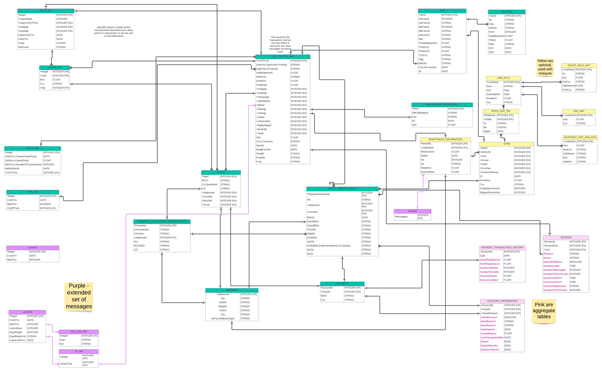

# Payments Fraud Use Case

This code is specific to the Payments Fraud use case of the LXA Platform.

The data model in use is 

Synthetic data generation code is a working progress, however - running the command:

```
python3 -m lxa_platform.payments_fraud.scripts.create_payments_fraud_tables
```

from the root directory will create the tables required for the data model in the "LXA_PMNTS_DB" on SnowFlake.

Synthetic Data work has started following a strategy meeting. To generate N happy flows, simply create an instance of the MessageFlowFactory object in scripts/Synthetic_Data/message_flow_factory. From here, call the create_happy_flows(number_of_flows) function on that object to generate your desired number of ISO20022 messages.

To create these tables in a different Snowflake instance / databaset edit ./scripts/configs/config.json correctly with your SnowFlake credentials for this command to work with your SnowFlake instance.

This use case involves Real Time Payments (RTPs) and the use of the ISO20022 messages. More specifically, PAIN_001, PACS_008 and PACS_002 are in use as the core set of messages involves in RTPs. We will set up this use case so that it can be easily extended to further messages if need be.
